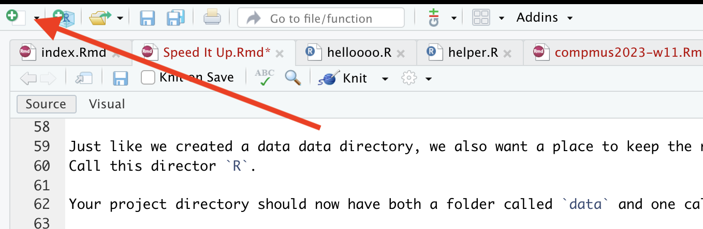

```{r, setup}
library(tidyverse)
library(plotly)
library(cowplot)
library(spotifyr)
library(compmus)
```

### Welcome to Computational Musicology 2023!

Welcome to Computational Musicology 2023!

You can access the lecture notes at the following links.

  - [Week 7 · Computational Musicology and (Audio) Visualisation](./notes/compmus2023-w07.html)
  - [Week 8 · Chromagrams](./notes/compmus2023-w08.html)
  - [Week 9 · Cepstrograms and Self-Similarity Matrices](./notes/compmus2023-w09.html)
  - [Week 10 · Chordograms and Keygrams](./notes/compmus2023-w10.html)
  - [Week 11 · Novelty Functions and Tempograms](./notes/compmus2023-w11.html)

This storyboard contains further examples from each week to inspire you. You can download the raw source code of the storyboard [here](./index.Rmd).

### What makes a good corpus?

You will work a corpus of your choice throughout the course and build up an online portfolio of quantitative musical analyses. Remember that the question _Compared to what?_ hangs over all quantitative results, and so be sure to choose a corpus that allows for meaningful – but not _too_ obvious – comparisons and contrasts. Most students end up with a corpus that has 2–5 obvious groups they can compare: see a list of examples below.

The size of the corpus is not important _per se_: with computational tools, it is just as easy to work with 1000 tracks as it is to work with 10. Practically speaking, you will need at least 50–100 tracks in your corpus in order to make meaningful comparisons. At the other extreme, if your corpus gets up to 10 thousand tracks or more, computations and visualisations will probably run too slowly to be usable for an online portfolio. But anything in between can work.

You also will want a few 'highlight' tracks that you can focus on for more in-depth analysis of harmony, structure, and rhythm. These could be your favourites, a good representative of each group, or even a very oddball track that shows something interesting about how the Spotify API works!

Here is a non-exclusive list of examples, combined with questions that (by the end of the course) you could explore.

*   Geographic Region
    *   Portugal and Brazil share a common language but have distinctly different cultures. Is there a difference in style preferences for pop music between the countries? Find recent charts – or use Spotify’s regional charts – and use a corpus including both.
    *   K- and J-pop is increasingly popular outside of Asia. How much does the sound of K- and J-pop boy- or girl-bands differ from their European counterparts? Choose a selection of albums, artists, or playlists from each group based on what is popular on Spotify or external sources.
*   Label or Studio
    *   How did Motown’s competitors differ in style during its heyday? Research the most popular Motown albums, identify competitors, and make a corpus including a selection from Motown and several major competing labels.
    *   Phil Spector’s ‘Wall of Sound’ was thought to be revolutionary – but how different does it sound, really? Make a corpus balancing a number of tracks produced Phil Spector with tracks of comparable popularity from the same time period.
*   Genre
    *   Every Noise at Once compares genres with surprisingly detailed names. Choose two or more genres from Every Noise at Once and try to clarify how they differ.
    *   Fans of heavy metal are notorious for the complexity of their understanding of sub-genres. Can Spotify measure them? Find a reliable classification of heavy-metal subgenres, make a selection of tracks of two or more of these subgenres, and look for similarities and differences.
    *   How does hip-hop from the 1990s differ from hip-hop today? Find reliable playlists or make your own selection of recent and older hip-hop and look for differences within and between the time periods.
*   Composer or Artist _N.B.: Spotify’s ‘This Is:’ and ‘Composer Weekly’ series are especially helpful here._
    *   Cher has reinvented herself many times. How has her style changed over time? Look at the audio features for each major album, and see if you can cluster them into distinct style periods.
    *   How does the harpsichord music of Rameau differ from that of Couperin? Find representative albums for each composer – ideally from the same performer – and look for differences within and between the composers.
    *   Beethoven’s piano sonatas have been interpreted and re-interpreted many times since the advent of recording technology. Choose a selection of sonatas and pianists, and make a corpus including all of the relevant performances in Spotify. How well can Spotify measure the difference between pianists?
*   Playlist
    *   What does it mean to be a ‘workout’ playlist? Find several examples of workout playlists on Spotify and comparable playlists without the workout label. Is there a measurable difference between the groups?
    *   Spotify Wrapped allows you to download a list of everything you listened to last year. How does your list compare to your parents’, friends’, or partner’s? 
*   Album
    *   Which Madonna albums were the most commercially successful? Does the commercial success correspond in any way to features computable from Spotify?
    *   Is the album still a meaningful concept? For your favourite artist, check whether the songs within albums are more similar to each other than songs on different albums. Is there a measurable pattern or formula for predicting which track will be first or last?
*   Piece
    *   Jazz standards like Gershwin’s ‘Summertime’ have been covered by countless artists. Make as complete a list as possible from the Spotify catalogue. How do the covers differ from each other? Is it possible to cluster the covers into groups? How could you interpret those clusters?
    *   Mozart’s 40th Symphony is one of the best known pieces of classical music, and there are at least 40 version of it on Spotify. Are there any differences between them? Is there a measurable difference between performances on major classical labels versus performances from lesser-known artists?

***

For many reasons, you will want to make a Spotify playlist of your corpus. Playlists make statistical analysis easier and also are easy to embed to make your portfolio more interactive.

<iframe src="https://open.spotify.com/embed/playlist/4xnBi0S21rFHhhK0iGHpiS?utm_source=generator" width="100%" height="380" frameBorder="0" allowfullscreen="" allow="autoplay; clipboard-write; encrypted-media; fullscreen; picture-in-picture"></iframe>

### What kind of portfolio do I need to create?

Your portfolio will be a 5–10-page dashboard in the style of the R package [flexdashboard](https://rstudio.github.io/flexdashboard/articles/using.html#storyboards-1), using data from the [Spotify API](https://developer.spotify.com). Your dashboard should cover the following topics, but note that it is possible (and often desirable) for a single visualisation or tab to cover more than one topic.

  - **Background**: Which tracks did you choose? Why? What questions will the dashboard answer?
  - **Track-level features**: What insights into your corpus can be drawn from Spotify’s track-level features (valence, danceability, etc.)?
  - **Chroma features** [pitch]: What insights into your corpus can be drawn from Spotify’s chroma features?
  - **Loudness** [volume]: What insights into your corpus can be drawn from Spotify’s ‘loudness’ (power) features, either at the track level or the section level?
  - **Timbre features** [timbre]: What insights into your corpus can be drawn from Spotify’s timbre features?
  - **Temporal features** [duration]: What is notable, effective, or ineffective about structural segments, metre, rhythm, or beats in your corpus, as derived from Spotify features?
  - **Classification/regression**: Where explicit labels in your corpus exist, how strong are Spotify features for classification or regression?
  - **Clustering**: Where explicit labels in your corpus are lacking, which Spotify features generate potentially meaningful clusters?
  - **Contribution**: What have you learned from this set of analyses? Who could these conclusions benefit, and how?

Depending on your topic, you may want to start with a text-based opening like this one; alternatively, you could put your most compelling visualisation directly on the first tab and just use the commentary to introduce your corpus and research questions.

***

The grading breakdown for the portfolio is as follows. The rubric was adapted from the Association of American Colleges and Universities (AAC&U) Inquiry and Analysis and Quantitative Literacy [VALUE rubrics](https://www.aacu.org/value-rubrics).

| Component            | Points |
|----------------------|:------:|
| Corpus selection     |      6 |
| Assumptions          |      6 |
| Representation       |      6 |
| Interpretation       |      6 |
| Analysis             |      6 |
| Presentation         |      6 |
| Transfer of learning |      6 |

### Do the Dutch really listen to happier music? [track-level features]

```{r, happy}
top_50_nl <- get_playlist_audio_features("", "37i9dQZEVXbKCF6dqVpDkS")
top_50_be <- get_playlist_audio_features("", "37i9dQZEVXbJNSeeHswcKB")
top_50_world <- get_playlist_audio_features("", "37i9dQZEVXbMDoHDwVN2tF")
top_50s <-
  top_50_nl |>
  mutate(country = "The Netherlands") |>
  bind_rows(top_50_be |> mutate(country = "Belgium")) |>
  bind_rows(top_50_world |> mutate(country = "Global")) |>
  mutate(
    country = fct_relevel(country, "Global", "The Netherlands", "Belgium")
  )

february_dip <-
  top_50s |>
  ggplot(                          # Set up the plot.
    aes(
      x = valence,
      y = energy,
      size = track.popularity,
      colour = danceability,
      label = track.name           # Labels will be interactively visible.
    )
  ) +
  geom_point() +                   # Scatter plot.
  geom_rug(size = 0.1) +           # Add 'fringes' to show data distribution.
  facet_wrap(~country) +           # Separate charts per country.
  scale_x_continuous(              # Fine-tune the x axis.
    limits = c(0, 1),
    breaks = c(0, 0.50, 1),        # Use grid-lines for quadrants only.
    minor_breaks = NULL            # Remove 'minor' grid-lines.
  ) +
  scale_y_continuous(              # Fine-tune the y axis in the same way.
    limits = c(0, 1),
    breaks = c(0, 0.50, 1),
    minor_breaks = NULL
  ) +
  scale_colour_viridis_c(          # Use the cividis palette
    option = "E",                  # Qualitative set.
    alpha = 0.8,                   # Include some transparency
    guide = "none"
  ) +
  scale_size_continuous(           # Fine-tune the sizes of each point.
    guide = "none"                 # Remove the legend for size.
  ) +
  theme_light() +                  # Use a simpler theme.
  labs(                            # Make the titles nice.
    x = "Valence",
    y = "Energy"
  )

ggplotly(february_dip)
```

***

In March 2019, [The Economist](https://www.economist.com/graphic-detail/2020/02/08/data-from-spotify-suggest-that-listeners-are-gloomiest-in-february?fsrc=scn/fb/te/bl/ed/sadsongssaysomuchdatafromspotifysuggestthatlistenersaregloomiestinfebruarygraphicdetail) published a graphic showing a worldwide dip in the emotional valence of the music to people people listen around February each year. The graphic also broke down the emotional valence for every month of the year for a selection of Spotify markets, and it revealed quite a surprise: although overall, there seemed to be two large groups, with Latin America and Spain listening to more positively valenced music than most of the rest of the world, the Netherlands stood on its own somewhere in between these two extremes. This graphic compares Spotify Top 50 in the Netherlands against Belgium, a more typical neighbouring country, as well as the worldwide average, on the standard valence--arousal model. More popular songs (worldwide) have larger dots; more danceable songs are yellow.

### Chromagrams Can Be Fun! [chroma features]

```{r pop-chroma}

ewf <-
  get_tidy_audio_analysis("3cfnGXJ9bmiWvFqEO6ff8B?si=fc8b75cc5a254be0") |>
  select(segments) |>
  unnest(segments) |>
  select(start, duration, pitches)

loveontop <-
  get_tidy_audio_analysis("1z6WtY7X4HQJvzxC4UgkSf?si=498f16c4cea74323") |>
  select(segments) |>
  unnest(segments) |>
  select(start, duration, pitches)

allineed <-
  get_tidy_audio_analysis("164VgxTozx99XCinCB9ITR?si=797ce93143424c36") |>
  select(segments) |>
  unnest(segments) |>
  select(start, duration, pitches)


```

```{r pop-chroma-plots}

ewf_plot <- ewf |>
  mutate(pitches = map(pitches, compmus_normalise, "euclidean")) |>
  compmus_gather_chroma() |> 
  ggplot(
    aes(
      x = start + duration / 2,
      width = duration,
      y = pitch_class,
      fill = value
    )
  ) +
  geom_tile() +
    geom_vline(xintercept = 53, color = "red") +

  labs(x = "Time (s)", y = NULL, fill = "Magnitude", title = "After the Love Has Gone (Earth, Wind, and Fire)") +
  theme_minimal() +
  scale_fill_viridis_c() 


loveontop_plot <- loveontop |>
  mutate(pitches = map(pitches, compmus_normalise, "euclidean")) |>
  compmus_gather_chroma() |> 
  ggplot(
    aes(
      x = start + duration / 2,
      width = duration,
      y = pitch_class,
      fill = value
    )
  ) +
  geom_tile() +
  geom_vline(xintercept = 184, color = "red") +
  labs(x = "Time (s)", y = NULL, fill = "Magnitude", title = "Love On Top (Beyonce)") +
  theme_minimal() +
  scale_fill_viridis_c() 


allineed_plot <- allineed |>
  mutate(pitches = map(pitches, compmus_normalise, "euclidean")) |>
  compmus_gather_chroma() |> 
  ggplot(
    aes(
      x = start + duration / 2,
      width = duration,
      y = pitch_class,
      fill = value
    )
  ) +
  geom_tile() +
  geom_vline(xintercept = 137, color = "red") +
  geom_vline(xintercept = 186, color = "red") +
  labs(x = "Time (s)", y = NULL, fill = "Magnitude", title = "All I Need (Collier, Mahalia, Ty Dolla $ign)") +
  theme_minimal() +
  scale_fill_viridis_c() 


plot_grid(ewf_plot, loveontop_plot, allineed_plot, ncol = 1)

```

***

Chroma can be a difficult concept to grasp, especially for those without musical training. The three charts on this page visualize three pop tunes that might help make this clearer.

The first plot shows a recording of [Earth Wind and Fire's After the Love is Gone](https://open.spotify.com/track/3cfnGXJ9bmiWvFqEO6ff8B?si=55c53dd6dfc643c6), which begins in [F Major, then modulates down to E major using a chord that is a tritone away](https://www.youtube.com/watch?v=ZBpV-n10sfo) at 0:55 seconds. Note how at that moment on the spectrogram-- marked in red-- a clear concentration of energy away from F over to B!  

The second plot shows Beyonce's [Love on Top](https://open.spotify.com/track/1z6WtY7X4HQJvzxC4UgkSf?si=ad690f7ecc594205). The tune is in a singular key for the first 2/3rd's of the song, but then at around 3:04 (184 seconds) the music modulates upwards each repeat of the chorus. Note here that the the chromagram is capturing the fact that the pitch classes are going up, though her voice is also singing higher (her tessitura!). Make sure not to confuse pitch height with chroma or pitch class! 

The last plot shows the tune [All I Need](https://open.spotify.com/track/164VgxTozx99XCinCB9ITR?si=612e1f79f92b4c23), which also has a modulation, but interestingly moves from [Eb Major](https://youtube.com/watch?v=Dv9iaRJG2Yc&si=EnSIkaIECMiOmarE&t=128) to what is essentially [Bb half sharp in standard tuning (A4 = ~452.89 according to this transcription!)](https://youtube.com/watch?v=Dv9iaRJG2Yc&si=EnSIkaIECMiOmarE&t=128). This point is highlighted by the red lines on the chromagram and notice that since this "key" does not fit that well into A440, the relative magnitute of the pitches that were quite prominent (Bb + F) are not really replaced by any other pitches!

### The Tallis Scholars sing Josquin more slowly than La Chapelle Royale -- except for one part [chroma features for DTW].

```{r tallis}
tallis <-
  get_tidy_audio_analysis("2J3Mmybwue0jyQ0UVMYurH") |>
  select(segments) |>
  unnest(segments) |>
  select(start, duration, pitches)
chapelle <-
  get_tidy_audio_analysis("4ccw2IcnFt1Jv9LqQCOYDi") |>
  select(segments) |>
  unnest(segments) |>
  select(start, duration, pitches)
maria_dist <-
  compmus_long_distance(
    tallis |> mutate(pitches = map(pitches, compmus_normalise, "manhattan")),
    chapelle |> mutate(pitches = map(pitches, compmus_normalise, "manhattan")),
    feature = pitches,
    method = "aitchison"
  )
```

```{r tallis-plot}
maria <-
  maria_dist |>
  mutate(
    tallis = xstart + xduration / 2,
    chapelle = ystart + yduration / 2
  ) |>
  ggplot(
    aes(
      x = tallis,
      y = chapelle,
      fill = d
    )
  ) +
  geom_tile(aes(width = xduration, height = yduration)) +
  coord_fixed() +
  scale_x_continuous(
    breaks = c(0, 60, 105, 150, 185, 220, 280, 327),
    labels =
      c(
        "Ave Maria",
        "Ave cujus conceptio",
        "Ave cujus nativitas",
        "Ave pia humilitas",
        "Ave vera virginitas",
        "Ave preclara omnibus",
        "O Mater Dei",
        ""
      ),
  ) +
  scale_y_continuous(
    breaks = c(0, 45, 80, 120, 145, 185, 240, 287),
    labels =
      c(
        "Ave Maria",
        "Ave cujus conceptio",
        "Ave cujus nativitas",
        "Ave pia humilitas",
        "Ave vera virginitas",
        "Ave preclara omnibus",
        "O Mater Dei",
        ""
      ),
  ) +
  scale_fill_viridis_c(option = "E", guide = "none") +
  theme_classic() +
  theme(axis.text.x = element_text(angle = 30, hjust = 1)) +
  labs(x = "The Tallis Scholars", y = "La Chapelle Royale")
maria
```

***

This visualisation of two performances of the famous ‘Ave Maria’ setting of Josquin des Prez uses the Aitchison distance between chroma features to show how the two performances align with one another. 

For the first four stanzas, the relationship between the performances is consistent: the Tallis Scholars sing the piece somewhat more slowly than La Chapelle Royale. For the fifth stanza (*Ave vera virginitas*, starting about 3:05 into the Tallis Scholars’ performance and 2:25 into La Chapelle Royale’s), the Tallis Scholars singing faster than La Chapelle Royale, but at the beginning of the sixth stanza (*Ave preclara omnibus*, starting about 3:40 into the the Tallis Scholars’ performance and 3:05 into La Chapelle Royale’s) the Tallis Scholars return to their regular tempo relationship with La Chapelle.

Although the interactive mouse-overs from `ggplotly` are very helpful for understanding heat maps, they are very computationally intensive. Chromagrams and similarity matrices are often better as static images, like the visualisation at left.

### What is the structure of ‘Blood, Sweat, and Tears’ [chroma and timbre features]

```{r hazes}
bzt <-
  get_tidy_audio_analysis("5ZLkc5RY1NM4FtGWEd6HOE") |>
  compmus_align(bars, segments) |>
  select(bars) |>
  unnest(bars) |>
  mutate(
    pitches =
      map(segments,
        compmus_summarise, pitches,
        method = "acentre", norm = "manhattan"
      )
  ) |>
  mutate(
    timbre =
      map(segments,
        compmus_summarise, timbre,
        method = "mean"
      )
  )
bind_rows(
  bzt |> 
    compmus_self_similarity(pitches, "aitchison") |> 
    mutate(d = d / max(d), type = "Chroma"),
  bzt |> 
    compmus_self_similarity(timbre, "euclidean") |> 
    mutate(d = d / max(d), type = "Timbre")
) |>
  mutate() |> 
  ggplot(
    aes(
      x = xstart + xduration / 2,
      width = xduration,
      y = ystart + yduration / 2,
      height = yduration,
      fill = d
    )
  ) +
  geom_tile() +
  coord_fixed() +
  facet_wrap(~type) +
  scale_fill_viridis_c(option = "E", guide = "none") +
  theme_classic() + 
  labs(x = "", y = "")
```

***

The two self-similarity matrices at the right, each summarised at the bar level but with axes in seconds, illustrate pitch- and timbre-based self-similarity within Andre Hazes's famous ‘Bloed, Zweet en Tranen’ (2002). Both are necessary to understand the structure of the song. The chroma-based matrix picks up the five presentations of the chorus very clearly but mostly misses the poignant changes in texture during the three verses. These changes are very visible in the timbre-based matrix, especially the third verse. The timbre-based matrix also illustrates the unbalanced song structure, climaxing about halfway through and thereafter simply repeating the chorus until the fade-out. The closing guitar solo is faintly visible in the top-right corner.

### Truck-driver modulations in the Year 2525 [tonal analysis]

```{r twenty-five}
circshift <- function(v, n) {
  if (n == 0) v else c(tail(v, n), head(v, -n))
}

major_key <-
  c(6.35, 2.23, 3.48, 2.33, 4.38, 4.09, 2.52, 5.19, 2.39, 3.66, 2.29, 2.88)
minor_key <-
  c(6.33, 2.68, 3.52, 5.38, 2.60, 3.53, 2.54, 4.75, 3.98, 2.69, 3.34, 3.17)
key_templates <-
  tribble(
    ~name, ~template,
    "Gb:maj", circshift(major_key, 6),
    "Bb:min", circshift(minor_key, 10),
    "Db:maj", circshift(major_key, 1),
    "F:min", circshift(minor_key, 5),
    "Ab:maj", circshift(major_key, 8),
    "C:min", circshift(minor_key, 0),
    "Eb:maj", circshift(major_key, 3),
    "G:min", circshift(minor_key, 7),
    "Bb:maj", circshift(major_key, 10),
    "D:min", circshift(minor_key, 2),
    "F:maj", circshift(major_key, 5),
    "A:min", circshift(minor_key, 9),
    "C:maj", circshift(major_key, 0),
    "E:min", circshift(minor_key, 4),
    "G:maj", circshift(major_key, 7),
    "B:min", circshift(minor_key, 11),
    "D:maj", circshift(major_key, 2),
    "F#:min", circshift(minor_key, 6),
    "A:maj", circshift(major_key, 9),
    "C#:min", circshift(minor_key, 1),
    "E:maj", circshift(major_key, 4),
    "G#:min", circshift(minor_key, 8),
    "B:maj", circshift(major_key, 11),
    "D#:min", circshift(minor_key, 3)
  )

get_tidy_audio_analysis("5UVsbUV0Kh033cqsZ5sLQi") |>
  compmus_align(sections, segments) |>
  select(sections) |>
  unnest(sections) |>
  mutate(
    pitches =
      map(segments,
        compmus_summarise, pitches,
        method = "acentre", norm = "manhattan"
      )
  ) |>
  compmus_match_pitch_template(key_templates, "aitchison", "manhattan") |>
  ggplot(
    aes(x = start + duration / 2, width = duration, y = name, fill = d)
  ) +
  geom_tile() +
  scale_fill_viridis_c(option = "E", guide = "none") +
  theme_minimal() +
  labs(x = "Time (s)", y = "", fill = "Distance")
```

***
    
The keygram at the left shows the two modulations in Zager and Evans's 'In the Year 2525' (1969). The piece is segmented according to Spotify's estimates, and the distances represented are Aitchison distances from Spotify's chroma vectors to the original Krumhansl--Kessler key profiles (1990). 

The piece does not follow common-era tonal conventions, and the key estimates are blurry. The move from G$\sharp$ minor to A minor about a minute and a half into the song is correctly estimated, despite the high spillage into related keys. The second modulation, to B$\flat$ minor, is misunderstood as F minor. The sparser texture two-and-a-half minutes into the song throws off the key-finding algorithm seriously.

### How am I supposed to dance when I can't find the beat? [temporal features]

```{r}
get_tidy_audio_analysis('6PJasPKAzNLSOzxeAH33j2') |> 
    tempogram(window_size = 8, hop_size = 1, cyclic = FALSE) |> 
    ggplot(aes(x = time, y = bpm, fill = power)) + 
    geom_raster() + 
    scale_fill_viridis_c(guide = 'none') +
    labs(x = 'Time (s)', y = 'Tempo (BPM)') +
    theme_classic()
```

***

The Fourier-based tempogram at the left is an attempt to use Spotify's API to analyse the tempo of Graveola's 'Samba de outro lugar'. Overall, Spotify estimates that the tempo of this track is 124 BPM, but looking in more detail at the tempogram, we see that the different sections of the piece lead to different strengths of so-called *tempo octaves*. In some freer-form sections of the piece, tempo estimation is almost impossible.

### Speeing Up Your Flexdashboard Workflow 

One of the most painful parts of working on your portfolio is having to wait for the entire dashboard to knit.
If you have several data intensive figures (e.g. any sort of heatmaps, tempograms, plotly) each can take anywhere from 45 seconds to three minutes based on your machine.
This means that as we get closer to submission, the time to knit will only go up if you keep all the visualizations you want in your portfolio as you work on it.

This document explains how you might be able to speed up this process, but it comes at the price of needing to be a bit more sophisticated in how you set up your project.

When implementing this, please first try to work through one graph.

#### The Problem

The problem with the current workflow is that each time you press Knit, you are re-creating everything for your dashboard/portfolio.

This means...

1. The `compmus` package needs to make its calls to the Spotify API
2. All the data needs to be downloaded from the API
3. Each plot needs to be re-rendered.

Usually, you have only made changes to one visualization, want to Knit to se if your change worked, but have not touched any other ggplot.
On top of this, may people's dataset is also not changing, so there is no need to re-download the data each time.
What's going on under the hood is akin to you downloading the same PDF over and over again into your Downloads when you just can't remember where you put it.

#### The Solution

The solution to this problem is create a copy of whatever data or plot you want somewhere separate to where the code is rendered and call the local version when the plot is rendered, rather than creating each plot each and every single time. 

Below we have suggested one way to set up this workflow. 

Please try this first only with ONE plot to make sure you understand, then begin to intergrate it into your own code.

##### Saving Your Data Locally

If your project is not constantly pulling new data, but rather something that doen't change like the entire Rihanna discography or the same set of playlists, there is no need to download this from the Spotify API each and every time.

What we are instead going to do is download this data once, save it somewhere in your project, then call that data when the dashboard is knit.
The exact same logic will apply to any `ggplot` as well.

This will create a bit more complex of a repository, but just follow these steps and this will work.

###### Create a Data Directory

The first thing you need to do is create a `data` folder in your portfolio.
You can do this by clicking the `New Folder` button in RStudio.

{width=75%}

This is where we will keep any and all data that we want to [cache]() for our project (aka not re-load every time).

###### Create an R Directory

Just like we created a data data directory, we also want a place to keep the new R scripts we will work on.
Call this director `R`.

Your project directory should now have both a folder called `data` and one called `R`.

(Excuse the other files there are in here!)

{width=75%}

###### Create A Specific Script

Our next general step is to create a specific R script that does one and only one thing.

For this first example, we are going to make a script that downloads our data.

We set this up by first making a new R Script with the new button on the top right.

{width=75%}

And IMMEDIATLY save this script as something like `download-data.R` in the `R` folder. 

###### Migrate Download Code to New Script 

The next step requires you to take the R code that you use in your flexdashboard for any downloading of your data and now move it to the `download-data.R` script.

For example, in Week 13 I may have wanted to get the audio analysis for the Graveola song we looked at.

Typically this line of code would be in my flexdashboard, but it is now moved to `download-data.R`.

```{r, echo = TRUE}
graveola <- get_tidy_audio_analysis("6PJasPKAzNLSOzxeAH33j2")
```

###### Save the Output 

Up until this point, we have not used any NEW functions.

This is the new, important step.

What the above line of code does is uses the function `get_tidy_audio_analysis()` to make an object called `graveola` in your Environment.
As discussed before, this happens each and every time that you Knit.

What we are going to do now is save the `graveola` object in an RDS format in the `data` directory.

```{r, echo = TRUE}
saveRDS(object = graveola,file = "data/graveola-data.RDS")
```

Here we use the `saveRDS()` function (you can read about [RDS here if you are a nerd](https://www.rdocumentation.org/packages/base/versions/3.6.2/topics/readRDS)) to first tell it WHAT we want to save (the `graveola` object) and then second tell it WHERE we want to store it.
In this case, using a character string to say put it in `data` and call it `graveola-data.RDS`.

If you run this whole script, what happens is that `download-data.R` calls the Spotify API, saves the data to an R object, then writes it to your local computer.

NOTE!
  
> For this to work, your R session needs to have all the packages already loaded (e.g. compmus, spotifyr) as well as have your secret keys accessible! You could load all of these libraries at the top of each new R script you are writing for your own sanity.

If you look in your `data` directory after completing this step, it should look like this:
  
{width=75%}

The entire final script of `download-data.R` will look like this:
  
```{r, echo = TRUE}
graveola <- get_tidy_audio_analysis("6PJasPKAzNLSOzxeAH33j2")

saveRDS(object = graveola, file = "data/graveola-data.RDS")
```

For exact examples of how this looks, check out this [repositories repo on Github](https://github.com/jaburgoyne/compmus2023).

###### Linking Local Data to Your flexdashboard

Now you have a LOCAL copy of your data, what you will need to change in your flexdashboard is where you were downloading this data to something different.

So your OLD code within your `index.Rmd` document would still have something like this:
  
```{r, echo = TRUE}
graveola <- get_tidy_audio_analysis("6PJasPKAzNLSOzxeAH33j2")
```

But now remember we are NOT using the API function in the flexdashboard file anymore (your `index.Rmd`).
We are now going to replace it with the cousin of `saveRDS()` which is `readRDS()`.

We swap out the code above with:
  
```{r, echo = TRUE}
graveola <- readRDS(file = "data/graveola-data.RDS")
```

Now the data during the Knit will come from your local computer, not the Spotify API.

Note here that if you ever want to update your data or change it, you need to update the `download-data.R` script and re-run it.
If you leave everything else the same, it will still save to the same file and it won't break your data pipeline.

> Try this first with your data before moving on to the next step!!

##### Doing this with your ggplots

The beautiful thing about RDS files is that they store any R data just as you would want it to exist in your R environment.

What this means is that **any object you create in your enviroment can be saved as an RDS file** which means that **ggplot** objects can be saved as RDS objects!

This is big news!
The same workflow that we used for our data can also be used to speed up the image rendering process.

Let's go through and example here using one of the tempogram plots that takes ages to render.

###### Create Tempogram R Script

As you start to get more advanced as a programmer, you stop saving all your functions in the same file.
Keep yourself organised by making another R script but this time we will call it `make-tempogram.R`.
Again, save this file in the `R` directory.

We mirror the same process above to first take out the code from our flexdashboard that is super slow and has to render each time, and we now put it in the new script, but make *two important changes*.

So let's say we find this code that makes a tempogram in our flexdashboard `index.Rmd`.

```{r, echo=TRUE}
graveola |>
  tempogram(window_size = 8, hop_size = 1, cyclic = TRUE) |>
  ggplot(aes(x = time, y = bpm, fill = power)) +
  geom_raster() +
  scale_fill_viridis_c(guide = "none") +
  labs(x = "Time (s)", y = "Tempo (BPM)") +
  theme_classic()
```

On my multi-thousand pound, for research, M1 chip macbook, this plot renders in about 45 seconds.
That's too long.

Remember it does it by taking our `graveola` object, then passing it into the `compmus` and `ggplot` functions in order to make it each and every time and does not save the results.

So we take the code above, and now we are going to cut it out and paste it into our `make-tempogram.R` script.

The *two important changes we need to make* are:
  
1. We need to assign this function's output to an object. Notice the function is now assigned `<-` to something called `graveola-plot`.
2. We need to save the `graveola-plot` object in the RDS format at the bottom of the script. 

Your `make-tempogram.R` script will have this code in it now:

```{r, echo=TRUE}
graveola_plot <- graveola |>
  tempogram(window_size = 8, hop_size = 1, cyclic = TRUE) |>
  ggplot(aes(x = time, y = bpm, fill = power)) +
  geom_raster() +
  scale_fill_viridis_c(guide = "none") +
  labs(x = "Time (s)", y = "Tempo (BPM)") +
  theme_classic()

saveRDS(object = graveola_plot, file = "data/graveola-plot.RDS")
```

Now make sure to run this code so the plot is created and the object is written to your local computer.

You could check that the new `.RDS` file is saved, see how to do that above using RStudio's finder.

###### Load in plot

As above, we follow the same process in our flexdashboard.

Where we used to have:
  
```{r, eval = FALSE, echo = TRUE}
graveola |>
  tempogram(window_size = 8, hop_size = 1, cyclic = TRUE) |>
  ggplot(aes(x = time, y = bpm, fill = power)) +
  geom_raster() +
  scale_fill_viridis_c(guide = "none") +
  labs(x = "Time (s)", y = "Tempo (BPM)") +
  theme_classic()
```

We cut this out and assuming that this code is happening below where we create the `graveola` object, we then put in:
  
```{r, echo=TRUE}
graveola_plot <- readRDS(file = "data/graveola-plot.RDS")
graveola_plot
```

And when this runs, it takes the _already rendered_ ggplot data, loads it in, then plots it.
This runs in about 3 seconds, which is 15x faster than before.

##### Working in this workflow

If you commit to this workflow, you will have a few more things to track but it comes with much much much faster Knits.

What we suggest doing is working on each plot individually, running it within the script you are working on, then continually saving it using the `saveRDS()` function.

You now will be able to iterate much more quickly through your plots, saving you time and frustration.

As this is a NEW workflow, if something does not work, please message David John Baker on Canvas right away, so we can make this tutorial clearer.
